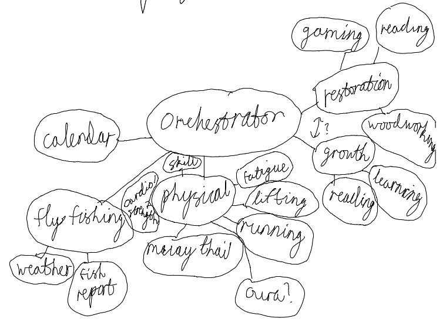

# Hobbymaxxing

## Problem

I have too many hobbies and ambitions, yet not enough time. It's hard to optimize doing them all with balance.

## Solution

Use an orchestration of agents to determine what to do and when.

## Questions

- What timespan is it deciding within?
- Should it be able to take feedback of feelings and actions to adjust answers or replan on the fly?
- What kind of variables should be considered?
- Should it draw on personal information like health trackers?

## Hobbies

- Fly fishing
  - weather
  - time of day
- Physical
  - Strength Training
  - Muay Thai
  - Running
    - physical fatigue
    - skill growth
- Restoration
  - Gaming
  - Woodworking
  - Reading
- Growth
  - Reading
  - Learning
  - Coding

## Agentic Breakdown

### Orchestrator

Prompts agents for suggestions/information. With the full scope, makes a final suggestion for what hobbies to do and when.

#### Personal System Check

Takes in calendar, health data, and how you're feeling to provide context for suggestions.
*Orchestrator checks availability, time, and feelings.*

#### Fly Fishing

Since fly fishing is more involved than the others, it gets its own agent. It will take into account weather, traffic, and fishing reports.

Additional context of what to wear, where to fish, and what flies to bring would be nice-to-have.

*Orchestrator checks traffic, weather, and physical well-being.*

#### Physical

I do numerous physical activities and need to balance my training to keep growing or maintaining. This takes into account how much I've been training strength, running, and doing muay thai particularly to balance out growth and fatigue. Can suggest alternatives like walking or yoga if injuries or breaks are needed. Accesses third-parties like Oura, Apple Health, and Strava to make personalized data-backed decisions.

#### Restoration

Focused on how much I've actually been relaxing and destressing both physically and mentally. May suggest activities such as gaming, reading, or woodworking. Takes into account the need to escape, get cozy, or be creative.

#### Growth

Lastly, we need to balance pleasure with growth. May suggest reading, coding, or learning to grow either career or personal interests.

